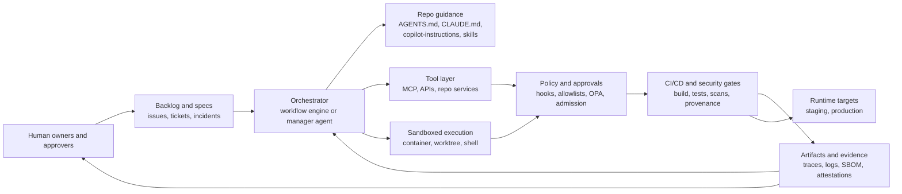
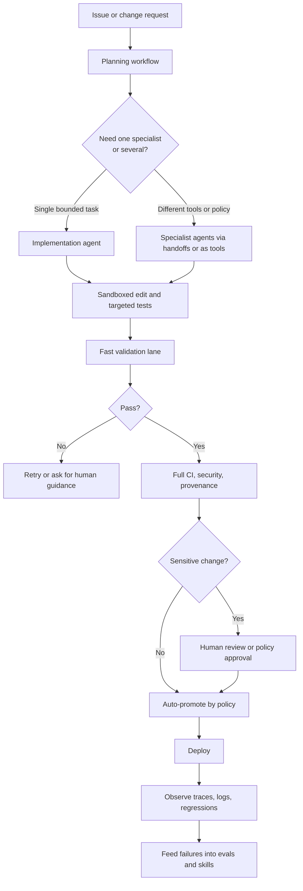

# Making a Codebase Coding Agent Ready for a Fully Agentic SDLC in 2026

## Executive summary

As of May 2026, there is still no single cross-vendor certification for a repository being “coding agent ready.” Instead, the ecosystem is converging on a practical stack of conventions and controls: repository-level instruction files such as `AGENTS.md`, `CLAUDE.md`, and `copilot-instructions.md`; tool interoperability through MCP; durable orchestration runtimes; sandboxed execution; agent-specific skills and hooks; and trace-and-eval loops that make agent behavior observable and testable. The strongest sources for this convergence are the official OpenAI, Anthropic, GitHub, MCP, and Linux Foundation materials, including the Agentic AI Foundation’s stewardship of MCP and `AGENTS.md`. citeturn32view3turn32view1turn39view0turn29search2turn29search6

A useful 2026 definition of **coding agent ready** is: a codebase and delivery system that an autonomous coding agent can understand, modify, validate, and promote safely with minimal hidden knowledge. In practice, that means six things: machine-readable project guidance, reproducible environments, explicit module and API contracts, fast and deterministic tests, tight runtime/tool permissions, and auditable execution artifacts. OpenAI’s agent guides, Anthropic’s Claude Code memory model, GitHub’s custom instructions and skills, and Google ADK’s agent framework all point in the same direction. citeturn33view4turn33view1turn39view2turn32view5turn11search0

A useful 2026 definition of **fully agentic SDLC** is: an SDLC in which agents are first-class executors across planning, implementation, testing, review, release, and some operational work, while humans shift to approvals, exception handling, policy setting, and risk ownership. AWS’s AI-DLC framing is the closest formalized 2026 model: AI-led execution paired with human-centric decisions. GitHub Copilot cloud agent, OpenAI Agents SDK, Anthropic Managed Agents, and Google ADK all now support meaningful portions of that operating model. citeturn28search1turn28search3turn35view1turn33view0turn26search0turn11search0

The highest-return modernization moves are not exotic. They are: make bootstrap deterministic; document build/test/validate commands in agent-readable files; expose clear service and data contracts; reduce module blast radius; make critical tests fast, hermetic, and scriptable; enforce least privilege at tool, network, and deployment boundaries; emit standardized traces and signed supply-chain artifacts; and keep human approval gates only where the risk justifies them. Organizations that skip these fundamentals usually end up with agents that can write code but cannot complete work safely or repeatedly. citeturn32view1turn39view2turn16search8turn17search0turn33view2turn34view1turn38view0turn7search10turn3search22

The main architectural recommendation for 2026 is to prefer **deterministic workflows around bounded agents**, not “one super-agent with all permissions.” LangGraph’s official distinction between predetermined workflows and dynamic agents, OpenAI’s guidance to start with one focused agent and split only when tools, policies, or ownership diverge, GitHub’s toolset minimization guidance, and Anthropic’s read-only subagent patterns all support a narrow, composable design. citeturn12search1turn33view4turn35view6turn37search3

## Definitions and scope

This report assumes **no fixed language, framework, or CI/CD system**. Recommendations are therefore language-agnostic first, with concrete examples for Python, JavaScript/TypeScript, and Java where the tooling is especially mature. The focus is a modern engineering repository or service, not model training pipelines or consumer chatbots. Where a standard predates 2026, it is included only if it remains part of the 2026 operating baseline. citeturn16search8turn16search1turn5search1turn6search0

### What coding agent ready means in practice

Operationally, a repository is coding-agent ready when an agent can discover the right context, choose the right commands, make a bounded change, run targeted validation, and leave behind verifiable evidence. OpenAI Codex explicitly reads `AGENTS.md` before work; GitHub Copilot supports repository-wide instructions, path-specific instructions, and `AGENTS.md`; Anthropic’s Claude Code expects `CLAUDE.md` but can import `AGENTS.md`; and GitHub agent skills are now an open standard for reusable task-specific behavior. That combination makes repository structure and instruction hygiene part of the product surface for agents, not just humans. citeturn32view3turn32view1turn39view2turn32view5

The strongest working definition is therefore: **a repository whose build, architecture, contracts, validation steps, permissions, and quality rules are explicit enough that an agent can operate without tribal knowledge**. This is an inference from the official docs rather than a formal standard, but it is the clearest cross-vendor synthesis available in 2026. citeturn32view1turn39view2turn33view4turn35view7

### What fully agentic SDLC means in practice

The closest formal 2026 framing is AWS’s AI-DLC, which describes AI-powered execution with human-centric decision-making across the lifecycle. A fully agentic SDLC therefore does **not** mean “humans absent.” It means agents can perform substantial lifecycle work independently, while humans retain policy control, production approvals, and accountable risk decisions. GitHub Copilot cloud agent already spans planning, code changes, tests, linters, and PR creation in an ephemeral GitHub Actions-backed environment; OpenAI and Anthropic now offer agent runtimes with tools, memory/state, and human review controls; and Google ADK explicitly targets build/evaluate/deploy cycles for production agents. citeturn28search1turn35view1turn33view0turn33view2turn26search0turn11search6

In other words, “fully agentic SDLC” should be interpreted as an **operating model**, not a single product choice. The necessary ingredients are workflow orchestration, controlled execution environments, approvals, evaluation, and auditability. citeturn33view3turn33view1turn38view2turn36view0

### What agent readiness is not

Agent readiness is not the same as having a high benchmark score on a coding model. SWE-bench Verified remains useful for issue-resolution tasks, but 2026 benchmark work such as SWE Atlas broadens evaluation into codebase Q&A, test writing, and refactoring. Separately, the SWE-agent paper showed that interface and tool design materially affect performance, which means repository ergonomics and harness design are part of readiness, not afterthoughts. citeturn14search6turn14search2turn14search1turn14search17

It is also not the same as letting an agent loose on production credentials or a monorepo with vague boundaries. Vendor guidance increasingly pushes toward narrow specialists, approvals, hooks, allowlists, and explicit tool surfaces rather than blanket autonomy. citeturn33view4turn34view1turn35view5turn35view2turn10search7

## Best practices across the stack

The 2026 best-practice baseline is to treat your codebase as a **machine-operable system**: legible to humans, but also explicit enough for agents to consume safely. The table below compresses the most important changes by domain. It reflects current vendor docs and standards, but the prioritization is analytical and language-agnostic. citeturn32view1turn39view2turn33view4turn38view0turn5search1

| Domain | What 2026 best practice looks like | Why it matters for agents | Representative evidence |
|---|---|---|---|
| Repository guidance | Keep a canonical project instruction layer in version control. Prefer `AGENTS.md` as the cross-agent baseline; import it into `CLAUDE.md` where needed; use GitHub repository and path-specific instructions for feature-specific context. Keep instructions concise and verifiable. | Agents fail most often on hidden conventions and missing task entrypoints. | OpenAI Codex reads `AGENTS.md`; GitHub supports `AGENTS.md`, `.github/copilot-instructions.md`, and path-specific instructions; Claude Code recommends `CLAUDE.md` and importing `AGENTS.md`. citeturn32view3turn32view1turn39view2 |
| Architecture and modularity | Prefer deterministic workflows around narrow specialists. Split agents only when tool surface, model, policy, or ownership differs. Keep modules small, responsibilities explicit, and side effects isolated. | Narrow modules and bounded specialists reduce context cost, tool confusion, and blast radius. | OpenAI handoffs/agents-as-tools; start with one focused agent; LangGraph’s workflow-vs-agent split; Claude’s read-only explore subagent. citeturn33view3turn33view4turn12search1turn37search3 |
| APIs and contracts | Publish machine-readable contracts for every external boundary: OpenAPI for HTTP, JSON Schema for payloads, protobuf/gRPC where RPC fits, and contract tests across service boundaries. | Agents reason better over explicit schemas than prose docs and can auto-generate clients, tests, and validators. | OpenAPI 3.1, JSON Schema, gRPC/proto, Pact contract testing. citeturn16search8turn16search3turn16search1turn17search0 |
| Testability | Create a fast, targeted “agent validation path” plus a fuller CI path. Use reusable fixtures, parametrized tests, browser traces for UI, and contract tests for integrations. | Agents need quick feedback loops; slow or flaky suites kill autonomy. | Pytest fixtures/parametrize, Playwright fixtures/trace viewer, JUnit guide, Pact. citeturn18search14turn18search2turn18search4turn18search1turn18search0turn17search0 |
| CI/CD | Make every stage invocable non-interactively, use ephemeral environments, OIDC-based cloud auth, concurrency controls, environment reviewers, and policy-enforced security scans or injected jobs. | An agent can only automate what CI/CD exposes as stable entrypoints and policy gates. | GitHub Actions concurrency and required reviewers; GitHub OIDC; GitLab pipeline execution policies; Jenkins shared libraries; Tekton Chains provenance. citeturn9search0turn9search20turn3search25turn9search1turn9search2turn9search3 |
| Observability and evals | Emit standardized traces for model calls, agent spans, and MCP/tool events; store artifacts; evaluate both final outputs and tool-use quality; regress changes continuously. | Agent systems must be measurable beyond “it looked good in chat.” | OpenTelemetry GenAI and MCP semantic conventions; OpenAI evals; ADK evaluation; LangSmith observability/evals. citeturn38view0turn38view1turn38view2turn38view3turn38view4turn13search18 |
| Security and runtime safety | Default to sandboxed execution, least privilege, small toolsets, MCP allowlists, human review for sensitive actions, and policy-as-code for cluster/runtime enforcement. | Autonomous code changes are useful only if filesystem, network, and deployment rights are tightly bounded. | OpenAI sandboxs/guardrails; GitHub hooks and MCP policy; gVisor; Kubernetes admission and Pod Security; OPA/Kyverno. citeturn33view1turn33view2turn35view2turn35view5turn15search0turn15search1turn8search10turn8search1 |
| Governance and supply chain | Produce SBOMs, sign artifacts and attestations, target a SLSA-capable build platform, and enforce admission/promotion based on verifiable metadata. | Agent-written code increases the value of tamper-evident provenance and artifact traceability. | CycloneDX, SPDX, SLSA, Sigstore/cosign, in-toto attestations, signed SPDX SBOM policy examples. citeturn6search0turn6search1turn3search22turn7search10turn7search0turn7search5 |
| Data handling | Separate local runtime context from model context, redact sensitive trace fields, and document retention semantics for hosted tools, background jobs, and third-party MCP servers. | Agents often touch more data than a human coder would manually paste into a chat window. | OpenAI local context vs model context; data controls and MCP retention caveats; CrewAI PII trace redaction; GitHub data-residency docs. citeturn33view4turn34view0turn34view1turn11search15turn31search6 |
| Developer experience | Give agents a stable command vocabulary, skills for recurring repo tasks, and hooks for checks/audit automation. Prefer canonical commands over ad hoc shell history. | Good DX for humans is usually good operability for agents; good operability for agents improves repeatability for humans. | GitHub agent skills and hooks; Anthropic skills/hooks; OpenAI skills/eval guidance; Jenkins shared libraries. citeturn32view5turn32view6turn10search2turn10search6turn38view3turn9search2 |

### Architecture and code patterns

The most important architectural change is to stop designing codebases purely for human navigation. Documentation and modules should be optimized for **selective context loading**: agents should be able to answer “where do API handlers live,” “what command validates only billing code,” and “which test proves this invariant” without scanning the whole repository. Anthropic explicitly recommends keeping project instructions to concrete, verifiable items such as build commands, folder locations, and always-do rules, and GitHub’s path-specific instructions system reinforces the same pattern. citeturn39view2turn32view1

In implementation terms, that usually means: thin entrypoints; domain modules with clear ownership; side effects behind adapters; stable command surfaces such as `make test-billing`, `npm run lint:web`, or `./gradlew :service:test`; and architectural rules that are easy to express in policy or tests. This is not just “clean code.” It is context compression for agents. OpenAI’s guidance to split agents only when instructions, tools, policies, or output styles materially differ is a good proxy for how you should split subsystems too. citeturn33view4

For language-specific examples, the 2026 baseline is straightforward. In Python, use explicit typed models and validation at boundaries, and prefer deterministic dependency injection over ambient globals; Pydantic’s strict mode and `validate_call` are particularly useful for enforcing clean tool and service interfaces. In JavaScript/TypeScript, keep schemas close to code and export JSON Schema when possible; Zod 4’s native JSON Schema conversion is useful for aligning runtime validation, API definitions, and model structured outputs. In Java, use Jakarta Validation and JUnit-based tests so DTOs, method contracts, and test discovery remain explicit and machine-friendly. citeturn22search2turn22search7turn20search0turn19search0turn19search5turn18search0

### APIs, schemas, and data contracts

A fully agentic SDLC depends on explicit contracts because agents are cross-boundary systems: they read repos, call APIs, invoke tools, and chain service outcomes. OpenAPI remains the most useful machine-readable description for HTTP APIs because it supports discovery, code generation, design linting, and test generation. JSON Schema remains the lowest-common-denominator payload contract for agent tools, typed outputs, and validation. gRPC and protobuf remain excellent when you want strongly typed RPC, generated stubs, and service definitions in a single source of truth. citeturn16search8turn16search3turn16search1turn16search5

The practical rule is simple: every external boundary an agent may touch should have a machine-readable contract and a set of executable examples. If you expose HTTP, that usually means OpenAPI plus example requests and responses. If you expose JSON payloads, it means JSON Schema or equivalent runtime validators. If you expose internal services or tools, it means protobuf or well-typed tool schemas. Without this, autonomous refactors become brittle because the agent has to reconstruct intent from code and prose. citeturn16search4turn16search15turn17search0

For data handling, follow OpenAI’s explicit separation between **conversation history** and **local run context**: put secrets, authenticated handles, database clients, and other runtime-only dependencies in local context, not in model-visible prompts. That pattern should become a general repository rule, regardless of vendor. citeturn33view4

### Testability, CI/CD, and feedback speed

An agent-ready repository needs two validation lanes: a **fast lane** that an agent can run often, and a **full lane** that the platform runs before merge or promotion. Pytest’s fixtures and parametrization, Playwright’s fixtures and trace viewer, Pact’s contract testing, and JUnit’s mature test platform all support this split well. The goal is not merely test coverage; it is **targetable coverage**. Agents need to know which subset to run after a local change and which broader gates remain pending in CI. citeturn18search14turn18search2turn18search4turn18search1turn17search0turn18search0

For CI/CD, the best 2026 practice is to expose stable workflow primitives rather than burying behavior in undocumented job logic. GitHub Actions now provides the pieces most teams need out of the box: concurrency control, OIDC-based cloud authentication, and required reviewers on deployment environments. GitLab’s pipeline execution policies serve the same governance role in GitLab-centric shops. Jenkins still works well when shared libraries keep pipelines consistent and testable. Tekton Chains is the strongest Kubernetes-native option when you want signed in-toto attestations and SLSA provenance in the pipeline itself. citeturn9search0turn3search25turn9search20turn9search1turn9search2turn9search10turn9search3turn9search7

A good litmus test is this: can a fresh sandbox from a commit SHA run a documented bootstrap command, a documented targeted validation command, and a documented full CI validation command without human interpretation? If not, the repository is not yet agent ready. That conclusion is a synthesis, but it follows directly from the way GitHub, OpenAI, and Anthropic agents rely on explicit instructions, repeatable environments, and automated validation. citeturn35view1turn33view1turn32view1turn39view2

### Observability, security, and governance

The observability baseline for 2026 is OpenTelemetry plus agent-specific semantics, even though the GenAI semantic conventions are still under development. Importantly, OpenTelemetry now defines not just model spans but also agent spans, events, metrics, and MCP-specific semantics. That is enough to standardize most engineering dashboards around latency, tool calls, retries, approval pauses, prompt versions, and failure hotspots, while keeping vendor lock-in lower than proprietary-only tracing. Because the schema is still evolving, version your dashboards and collectors explicitly. citeturn38view0turn38view1

Runtime safety has also become much more concrete in 2026. OpenAI’s sandbox agents and shell tool separate orchestration from execution and support isolated filesystems, commands, packages, ports, snapshots, and resumable state. GitHub Copilot cloud agent runs in an ephemeral GitHub Actions-powered development environment and records session logs. Anthropic’s hooks and subagents allow narrower permission surfaces, and its docs explicitly warn against overly broad permission matchers. The architectural lesson is consistent: do not grant write, network, or deployment capability to your reasoning layer directly; put those capabilities behind a sandbox, a hook, a policy, or a review gate. citeturn33view1turn33view6turn35view1turn37search6turn10search7turn37search3

For governance and compliance, a strong 2026 baseline is: SBOMs in CycloneDX or SPDX, signed artifacts and attestations with Sigstore, SLSA-aware build platforms, admission control or policy-controller enforcement at deploy time, and audit logs streamed to a SIEM. NIST SSDF remains the best general secure-development backbone, while the NIST AI RMF generative AI profile and OWASP’s 2026 agentic application guidance are the right overlays for agent-specific risks such as prompt injection, tool misuse, and autonomy overreach. citeturn6search0turn6search1turn7search10turn7search1turn7search5turn3search22turn5search1turn5search4turn5search2turn5search14

## Tooling and platform comparison

The comparison below prioritizes official documentation and focuses on what each platform or standard contributes to an agentic SDLC, not on vendor marketing claims. The “best fit” guidance is an analytical synthesis, while the capability statements come from the cited sources. citeturn33view0turn26search0turn35view1turn11search0turn12search0turn29search7turn25search0

| Tool or standard | What it is best for | Why it is strong in a fully agentic SDLC | Main caveat |
|---|---|---|---|
| OpenAI Agents SDK + Sandbox Agents | Code-first agent workflows where you want tools, approvals, handoffs, structured outputs, tracing, and containerized execution | Strong separation of orchestration from execution, clean support for guardrails/human review, local-vs-model context separation, and hosted or self-hosted shell/sandbox execution. citeturn33view0turn33view1turn33view2turn33view4turn33view6 | You still need to design the harness, evals, and policy gates well; background mode and third-party MCP use have data-retention implications. citeturn34view0turn34view1turn34view3 |
| OpenAI Codex | Interactive or delegated coding-agent work centered on repositories and worktrees | Native `AGENTS.md`, subagents, app/IDE/CLI surfaces, approval and sandbox controls, and strong guidance for repo-local skills and repeatable maintenance workflows. citeturn32view3turn27search0turn27search1turn27search17 | Best when your repository already has explicit commands and guidance; otherwise its capabilities mostly expose repo ambiguity faster. citeturn32view3turn27search16 |
| Anthropic Claude Code + Agent SDK + Managed Agents | Terminal-native coding agents and managed autonomous sessions with strong project memory patterns | Excellent project memory model via `CLAUDE.md`, importable `AGENTS.md`, skills, hooks, subagents, and a managed agent offering with persistent event history and secure sandboxing. citeturn39view2turn10search2turn10search6turn37search3turn26search0turn26search1 | Cross-tool compatibility usually requires a canonical repository contract plus import/symlink discipline. `CLAUDE.md` is not automatically the same as `AGENTS.md`. citeturn39view2 |
| GitHub Copilot cloud agent | GitHub-centered asynchronous SDLC execution on branches and PRs | Strongest when your lifecycle already lives on GitHub: research, planning, code changes, tests, linters, PR automation, session logs, enterprise AI controls, hooks, custom agents, and auditability. citeturn35view1turn35view0turn35view2turn36view0turn36view2 | Less portable outside GitHub’s environment and governance model; local-agent parity is not automatic. citeturn36view3 |
| Google ADK | Multi-agent applications where you want production-oriented agent framework features and A2A integration | ADK explicitly targets build/evaluate/deploy workflows, supports multiple languages, and now includes graph-based workflows, collaborative agents, memory services, and A2A support. citeturn11search0turn25search11turn25search1turn25search16 | Some newer ADK capabilities are still beta or experimental, so long-term API stability can lag simpler frameworks. citeturn25search11turn25search5turn25search9 |
| LangGraph | Deterministic orchestration around long-running, stateful agents | Particularly strong for durable execution, interrupts, human-in-the-loop, and clear separation between workflow structure and agent autonomy. citeturn12search0turn12search1turn12search4 | Lower-level than turnkey coding agents; you must still compose the repo conventions, tools, and runtime policies yourself. citeturn12search0 |
| MCP | Tool and context interoperability across agent hosts | Best open standard for connecting agents to tools, data sources, and workflows; now governed under the Agentic AI Foundation; supported by OpenAI, Anthropic, GitHub, and OpenTelemetry semantics. citeturn29search7turn29search2turn33view7turn37search13turn38view1 | MCP servers are third-party services with their own retention and trust models; use approvals, allowlists, and logging. citeturn34view1turn35view5 |
| A2A | Agent-to-agent interoperability across frameworks and vendors | Best when agents need to discover and call remote agents through a standard transport; 2026 docs frame it as the common language for agent interoperability, including Agent Cards. citeturn25search0turn25search2 | It solves agent-to-agent communication, not repository operability or runtime safety by itself. citeturn25search0 |

A separate but equally important tooling layer sits underneath every option above: **OpenTelemetry for traces**, **CycloneDX/SPDX + Sigstore + SLSA for provenance**, **OPA/Kyverno/Kubernetes admission for runtime policy**, and your chosen CI/CD control plane. These are not optional in a mature agentic SDLC; they are the scaffolding that keeps agent actions inspectable and enforceable. citeturn38view0turn6search0turn6search1turn7search10turn3search22turn8search10turn8search13

## Reference architecture and workflow

The cleanest 2026 architecture is a **workflow engine or manager agent** that owns control flow, a **sandboxed execution plane** for all filesystem and shell work, a **policy plane** for approvals and runtime constraints, an **observable tool layer** for MCP/API calls, and a **CI/CD plane** that produces signed evidence. That separation reflects both the OpenAI and GitHub models and aligns with LangGraph’s durable workflow approach. citeturn33view1turn33view3turn35view1turn12search0turn12search4

This architecture should be implemented with a few hard rules. All writes, builds, and tests happen in the sandbox. All external tool calls flow through a recordable tool layer. All privileged actions are guarded by hooks, approvals, or policy engines. Production promotion is never a direct model capability; it is a CI/CD transition backed by signed evidence and, where risk warrants, human reviewers. citeturn33view1turn33view2turn35view2turn7search1turn9search20

The workflow pattern should also be explicit about where agents are dynamic and where the path is fixed. LangGraph’s official guidance is the right abstraction: use workflows when paths are predetermined; use agents when the solution path is genuinely dynamic. OpenAI’s split between handoffs and “agents as tools” lines up with the same design choice. citeturn12search1turn33view3

A practical 2026 refinement is to maintain **different permission classes of agents**. At minimum, use a read-only exploration/planning role and a write-capable implementation role. Anthropic’s built-in explore subagent is a good reference pattern, and GitHub’s guidance to enable only the MCP toolsets you need points in the same direction. citeturn37search3turn35view6

## Migration checklist and phased rollout

The table below is intentionally repository-centric and size-neutral. Estimated effort is heuristic and should be read as **per major service or repository**, not enterprise-wide. A monorepo with weak boundaries can multiply the effort substantially. The priority ordering is conservative: it favors the changes that create operational leverage earliest. This sequencing is a synthesis of the official platform guidance, not a vendor-prescribed rollout. citeturn32view1turn39view2turn35view1turn38view2

| Workstream | What to do | Priority | Typical effort | Why first |
|---|---|---:|---:|---|
| Deterministic bootstrap | Reduce setup to one documented command; pin toolchains; make env setup reproducible in containers or ephemeral runners | Highest | 2–5 days | Agents cannot work reliably if setup is manual or stateful |
| Canonical repository instructions | Create `AGENTS.md` as the cross-agent baseline; map/import to `CLAUDE.md` and GitHub instructions; document build, test, validate, folder layout, and “never do X” rules | Highest | 1–3 days | This is the highest-ROI context fix for autonomous work |
| Stable command vocabulary | Add standard commands for targeted tests, full validation, formatting, type checks, docs, and package/build tasks | Highest | 2–5 days | Converts tribal knowledge into machine-operable entrypoints |
| Module and ownership cleanup | Reduce giant files, isolate side effects, define service boundaries, and annotate ownership in code/docs | High | 1–4 weeks | Lowers context burden and blast radius |
| Schema and contract exposure | Publish/validate OpenAPI, JSON Schema, protobuf, or typed DTO boundaries; add executable examples | High | 3–10 days | Lets agents reason over interfaces instead of guessing |
| Fast validation lane | Create a sub-10-minute critical validation path where feasible: targeted unit/integration tests, lint, type check, contract checks | High | 3–10 days | Necessary for iterative autonomous repair loops |
| Observability and trace correlation | Emit OTEL traces for agent runs, tool calls, CI jobs, and deployments; correlate run IDs, commit SHAs, and artifact digests | High | 1–2 weeks | Without traces you cannot debug or govern autonomous work |
| Policy and secrets hardening | Move to OIDC/cloud federation, narrow scopes, remove long-lived credentials from agent environments, add hooks/policies/allowlists | High | 1–2 weeks | Most dangerous failure mode is autonomy with excess privilege |
| Supply-chain evidence | Generate SBOMs, sign images/artifacts, attach in-toto attestations, and enforce provenance at promotion or admission | Medium-high | 1–2 weeks | Needed before broad autonomous release automation |
| Evaluation flywheel | Build seeded task sets, capture traces and diffs, score outputs and tool use, regress every harness or prompt change | Medium-high | 1–2 weeks | Prevents “it feels better” drift |
| Agentized delivery steps | Let agents open PRs, label issues, run standard fixes, and prepare release branches under policy | Medium | 1–3 weeks | Best added after evidence and controls already exist |
| Production autonomy expansion | Only after prior steps are green, widen autonomy for low-risk deploys or maintenance tasks with rollback and alerting | Medium | 2–6 weeks | Final step, not first step |

A sensible rollout path is: **foundation first, safe autonomy second, broad autonomy last**. In most organizations, that means targeting one representative service and one UI or workflow-heavy repo before touching the largest monorepo or the highest-risk production systems. Benchmark saturation and workflow-specific evaluation work in 2026 both argue against assuming that success on simple issue-fix tasks will transfer automatically to refactors, test writing, or multi-service changes. citeturn14search6turn14search2turn14search1

### Refactor checklist for the repository itself

Use this checklist as the practical “definition of ready to onboard an autonomous coding agent”:

| Checklist item | Ready when |
|---|---|
| Build/test commands | Every important validation step is invocable by a documented command with no hidden shell assumptions |
| Instructions | The repo has a canonical agent-readable instruction file and path-specific guidance where needed |
| Local setup | Fresh clone to runnable state works in an ephemeral environment without manual IDE clicks |
| Boundaries | Major modules have clear responsibilities and explicit owners |
| Contracts | All external boundaries have schemas/specs and validation |
| Fixtures | Tests use reusable fixtures and data builders instead of depending on ambient state |
| Secrets | No long-lived deploy secrets are exposed to agent runtimes when OIDC or alternatives exist |
| Policies | Sensitive commands, external MCP tools, and prod deploys are gated by review or policy |
| Evidence | CI produces logs, traces, SBOMs, and signed attestations linked to commit SHA |
| Rollback | Service or app has a tested rollback path that an operator can execute quickly |

## Acceptance criteria, compliance, and common pitfalls

The acceptance table below is intentionally measurable. The thresholds are recommended targets, not industry standards, but they are strict enough to distinguish “agent demos” from “agent-operable engineering systems.” The design of the tests is grounded in official guidance on evals, tool-use quality, traces, audit logs, and runtime controls. citeturn38view2turn38view3turn38view4turn36view0turn36view2

| Capability | Acceptance target | How to test it | Evidence to retain |
|---|---|---|---|
| Bootstrap readiness | Fresh sandbox reaches green targeted validation with zero manual steps in at least 19 of 20 runs | Start from clean SHA in ephemeral env and replay documented setup + targeted validation | Logs, runner image/version, elapsed time, SHA |
| Instruction quality | Agent instruction file answers location, build, test, validation, and “do-not-do” questions without human clarification | Run a fixed prompt pack against the repo and score for correct command and file targeting | Prompt set, traces, scoring rubric |
| Change isolation | At least 90% of low-risk tasks modify only intended modules and tests | Seed tasks that should stay within one subsystem and inspect diffs/contracts | Diff scope report, ownership checks |
| Validation speed | Critical fast lane completes in a time budget the team commits to, ideally under 10 minutes for routine PR work | Time the targeted lane on representative changes | CI timing history |
| Tool-use quality | Agent selects the correct tool or command sequence on a seeded task set at or above a rubric threshold | Use rubric-based tool-use evals, similar to ADK/OpenAI patterns | Evals, traces, per-rubric scores |
| Safety controls | Unauthorized network access, secret access, dangerous shell commands, and unapproved deploy attempts are blocked 100% of the time in red-team tests | Script red-team prompts and verify hooks/policies/approvals block them | Hook logs, policy decisions, approval records |
| Auditability | Every agent-induced mergeable change can be joined across session ID, commit SHA, CI run, SBOM, and attestation digest | Perform end-to-end traceability drill on sampled changes | Audit log export, trace IDs, artifact metadata |
| Supply-chain integrity | 100% of deployable artifacts have verifiable SBOM + provenance + signature | Verify in CI and at admission/deploy time | SBOMs, cosign/in-toto verification output |
| Data handling | No secrets or disallowed PII appear in retained traces/logs on seeded tests | Run seeded scans and redaction checks across traces | Trace export, scanner output, retention config |
| Regression control | Harness, instruction, or model changes cannot ship without passing eval regressions | Require eval suite on every harness change | Eval run history and thresholds |

A strong compliance and audit posture in 2026 links **agent session records**, **CI/CD evidence**, and **artifact provenance**. GitHub enterprise audit logs retain agentic activity for 180 days and expose agent-session-linked fields such as `agent_session_id`; GitHub also recommends streaming logs to a SIEM for long-term retention and anomaly detection. That should be paired with build attestations and SBOMs so every autonomous change can be reconstructed from prompt/session through artifact/deploy. citeturn36view0turn36view1turn36view2

Data-handling policy must also be explicit about vendor retention boundaries. OpenAI’s data-controls docs make clear that Zero Data Retention changes endpoint behavior, that background mode retains data long enough for polling, and that remote MCP servers are third-party services with their own policies. That means “ZDR-compatible agent system” is not a blanket property of the platform alone; it is an end-to-end architecture property, including every tool endpoint you call. citeturn34view0turn34view1turn34view3

### Common pitfalls and how to mitigate them

| Pitfall | What goes wrong | Mitigation |
|---|---|---|
| Hidden tribal knowledge | Agents choose wrong commands, wrong files, or skip required checks | Put commands, boundaries, and “always/never” rules in canonical instruction files and reusable skills |
| Giant, fuzzy modules | Context windows bloat and diffs spill across unrelated files | Refactor toward smaller bounded modules and explicit adapters |
| Too many tools | Agents thrash between tools or invoke unsafe ones | Minimize toolsets, use MCP allowlists, and split specialists by tool surface |
| Slow or flaky test suites | Autonomous loops become too slow or misleading | Create a fast lane with fixtures/parametrization and quarantine flaky tests |
| Over-broad credentials | A mistaken agent action becomes a security incident | Use OIDC, short-lived creds, approvals, and sandbox/network restrictions |
| Missing provenance | You cannot prove what changed, who initiated it, or what artifact was deployed | Require signed attestations, SBOMs, and correlated audit logs |
| Benchmark overfitting | Teams believe issue-fix performance implies SDLC readiness | Measure refactoring, test-writing, codebase Q&A, and tool-use quality too |
| Retention blind spots | Sensitive data leaks into traces, MCP logs, or background job state | Classify data paths explicitly and test redaction and retention behavior |

## Further reading and limitations

The strongest primary sources for continued implementation work are the official docs for OpenAI Agents SDK, Sandbox Agents, Guardrails, Shell, Evals, and Data Controls; Anthropic Claude Code memory/hooks/skills/MCP and Managed Agents; GitHub Copilot custom instructions, hooks, MCP, enterprise agent controls, and audit logs; Google ADK and A2A; MCP itself; OpenTelemetry GenAI semantic conventions; SLSA; Sigstore; CycloneDX; SPDX; NIST SSDF and AI RMF generative AI profile; and OWASP’s 2026 guidance for agentic applications. citeturn33view0turn33view1turn33view2turn33view6turn38view2turn34view0turn39view2turn10search6turn10search2turn37search13turn26search0turn35view7turn36view2turn25search0turn29search7turn38view0turn3search22turn7search10turn6search0turn6search1turn5search1turn5search4turn5search2

A short curated reading list:

- **OpenAI**: Agents SDK, Sandbox Agents, Guardrails and human review, Working with evals, Data controls. citeturn33view0turn33view1turn33view2turn38view2turn34view0
- **Anthropic**: Claude Code memory model, hooks, skills, subagents, Claude Managed Agents. citeturn39view2turn10search6turn10search2turn37search3turn26search0
- **GitHub**: Repository instructions, agent skills, hooks, MCP policies, cloud agent, audit logs. citeturn32view1turn32view5turn35view2turn35view5turn35view1turn36view1
- **Interoperability**: MCP spec and A2A protocol. citeturn29search7turn25search0
- **Observability**: OpenTelemetry GenAI and MCP semantic conventions. citeturn38view0turn38view1
- **Supply chain**: SLSA, Sigstore, CycloneDX, SPDX. citeturn3search22turn7search10turn6search0turn6search1
- **Governance**: NIST SSDF, NIST AI RMF generative AI profile, OWASP Top 10 for Agentic Applications 2026. citeturn5search1turn5search4turn5search2

### Open questions and limitations

This report reflects public documentation available on May 14, 2026. Several important elements are still evolving: OpenTelemetry’s GenAI semantic conventions remain in development; parts of Google ADK 2.0 and A2A integrations are still beta or experimental; and there is still no universally accepted, vendor-neutral certification for “coding agent readiness.” The definitions and acceptance criteria in this report are therefore rigorous practical synthesis, not formal standards text. citeturn38view0turn25search11turn25search5turn29search6