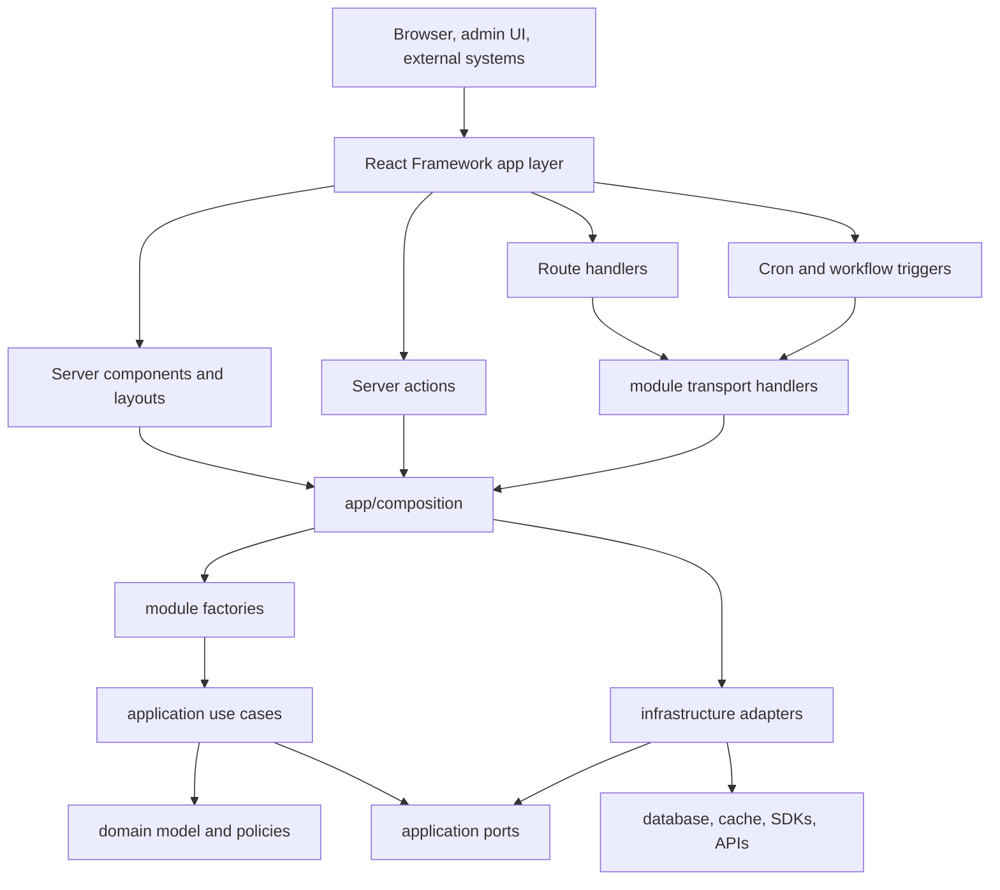

# Architecture Reference

This document abstracts the architecture of this application into reusable patterns for a new, distinct app. It is not a product specification. It describes the structural decisions, dependency direction, module boundaries, and operational guardrails that make the codebase maintainable as a modular monolith.

## Summary

The app is a server-first TypeScript modular monolith organized around vertical feature modules. Server framework (i.e. Next.js or TanStack) is kept at the edge for pages, route handlers, server actions, and workflow entry points. Business capability lives under `modules/<feature>`, where each feature owns its domain model, use cases, ports, adapters, transport helpers, configuration, and public exports.

The core dependency direction is:

```text
app / transport -> composition -> application use cases -> domain
                                     |
                                     v
                                  ports
                                     ^
                                     |
                              infrastructure adapters
```

In practice:

- `app/` owns framework entry points and rendering.
- `app/composition/` wires real infrastructure into feature factories.
- `modules/<feature>/factory.ts` assembles use cases from explicit dependencies.
- `modules/<feature>/application/use-cases/` owns orchestration.
- `modules/<feature>/application/ports/` defines IO contracts.
- `modules/<feature>/domain/` owns business types, invariants, and domain errors.
- `modules/<feature>/infrastructure/` implements ports with databases, SDKs, queues, cache clients, and external APIs.
- `modules/<feature>/transport/` translates wire protocols into use-case calls.
- `modules/kernel/` provides stable cross-cutting primitives such as IDs, errors, validation, configuration, database access, cache, time, auth helpers, and observability.

## System Shape



The important property is not the exact folder names. The important property is that each layer has a narrow reason to exist and only depends inward or on explicit contracts.

## Top-Level Responsibilities

### `app/`

The `app/` directory is the framework edge. It contains:

- pages and layouts.
- Route handlers for public HTTP APIs, webhooks, cron endpoints, and security reporting endpoints.
- Server actions for authenticated internal UI mutations and reads.
- Composition roots under `app/composition/`.
- Vercel Workflow orchestration and step wrappers under `app/composition/workflows/`.

Page components should be thin. A server component may fetch data through a composed use case and pass serialized props to client components. It should not reach into repositories, SDKs, or database schema.

Route handlers should be thinner than transport handlers. A route typically binds request context, obtains a composed handler from `app/composition`, and invokes it.

Server actions are preferred over API endpoints for internal UI interactions. They validate their input, apply authentication and authorization wrappers, call use cases, and return typed result objects.

### `modules/`

Each feature module is a vertical slice. A module should be understandable as a standalone capability with a public API and hidden implementation details.

A typical module shape is:

```text
modules/<feature>/
  index.ts
  factory.ts
  config/
  domain/
  application/
    ports/
    use-cases/
    cache/
  infrastructure/
    drizzle/
    <vendor-or-adapter>/
  transport/
    http/
```

Not every module needs every folder. Small modules can start with only `domain`, `application`, `factory.ts`, and `index.ts`. Add infrastructure, transport, and config only when there is a real adapter or entry-point concern.

### `modules/kernel/`

The kernel is foundational and should be boring. It contains shared primitives that are stable across features:

- Branded IDs and value schemas.
- Application and domain error classes.
- Clock, cache, transaction, and ID generator ports.
- Database connection and schema.
- Environment configuration parsing.
- Request context, structured logging, metrics, and telemetry.
- HTTP response, auth, CSRF, cron, redirect, and security-header helpers.

Feature modules may depend on kernel. Kernel must not depend on feature modules.

### `components/`, `hooks/`, and `lib/`

UI components and hooks are shared presentation infrastructure. They should not become a back door into business logic. Client-side async transitions should use the shared async-state pattern instead of ad-hoc loading, error, and data state.

`lib/` is for foundational utilities that are not feature-specific. Avoid vague dumping grounds. Prefer a named concern path over a generic `utils.ts`.

## Layer Rules

### Domain

Domain code is pure business logic. It can define:

- Entities, records, value objects, branded IDs, schemas, and invariants.
- Domain errors and state-transition policies.
- Pure formatting or decision functions that do not perform IO.

Domain code must not import infrastructure, transport, Router, database query builders, SDK clients, or application orchestration code.

### Application

Application code owns use cases and orchestration. It can:

- Coordinate repositories, gateways, clocks, ID generators, and loggers through ports.
- Own transaction boundaries, cache policy, idempotency, retries, dedupe, and side-effect sequencing.
- Return explicit result unions that encode expected outcomes.

Application code must not import infrastructure adapters directly. If a use case needs a database, cache, queue, email provider, AI model, payment processor, or clock, it receives that dependency through a port.

### Ports

Ports are interfaces owned by the application layer. They describe what the application needs from the outside world without leaking how it is provided.

Good ports are named by capability:

```text
UserRepository
EventRsvpConfirmationEmailSender
OccasionCommunicationWhatsAppSender
CacheGateway
Clock
TransactionRunner
```

Ports should depend on domain types and small DTOs. They should not depend on use-case implementations, database rows, SDK request objects, or transport payloads.

### Infrastructure

Infrastructure implements ports. It is where SDKs, Drizzle, Redis, external HTTP, payment providers, email providers, messaging providers, and AI provider clients belong.

Adapters translate external details into application-level contracts:

- Map DB rows into domain records.
- Convert SDK failures into application or system errors.
- Hide SDK request and response shapes from use cases.
- Keep vendor-specific names, pagination, status codes, and retry details out of domain logic.

Infrastructure may import its module's domain and ports, and it may use kernel infrastructure. Cross-module infrastructure imports should be avoided. Shared infrastructure belongs in kernel or behind another module's public API.

### Transport

Transport translates a wire protocol into application calls. Examples include webhook handlers, cron endpoints, and HTTP request handlers.

Transport can:

- Parse and validate request bodies, headers, query strings, form data, and signatures.
- Map domain/application errors to HTTP responses.
- Trigger background work after sending an acknowledgement.
- Log protocol-level events.

Transport should not contain business rules. Once input has been validated and normalized, it should call a use case.

### Composition

Composition is the only normal place where infrastructure and use cases are wired together.

Composition roots live under `app/composition/`. They:

- Import infrastructure adapters.
- Import module factories and public module APIs.
- Provide production defaults.
- Accept optional override instances for tests.
- Return cached singletons when called with no overrides.
- Return fresh instances whenever overrides are provided.

This keeps production code simple and tests isolated.

## Factory Pattern

The codebase uses a three-layer factory pattern instead of a DI container.

### 1. Module Factories

`modules/<feature>/factory.ts` contains pure functions that accept already-created dependencies and return use cases.

Rules:

- Accept instances, not lazy factory functions, unless laziness is part of the use-case contract.
- Do not create defaults.
- Do not cache.
- Keep dependency names explicit.
- Return a grouped use-case object when that feature has several related operations.

### 2. Composition Roots

`app/composition/<feature>.ts` wraps module factories with production defaults and optional overrides.

Rules:

- Override interfaces should make every field optional.
- Use `??` for defaults.
- Extract resolver functions only when they reduce real complexity, such as several repositories sharing the same logger, DB, clock, or config.
- Keep external SDK construction and infrastructure imports in composition, not in use cases.

### 3. Cached Factories

`createCachedFactory` returns a singleton only for the no-overrides production path. Any override means a fresh instance.

This gives:

- Production reuse without a global DI container.
- Test isolation for partial overrides.
- Clear wiring that can be inspected from a single composition file.

## Public Module APIs

Each module exposes a deliberate public API from `index.ts`.

The public API can export:

- Domain types and constructors.
- Port interfaces.
- Use-case factory functions.
- Module factory functions.
- Stable constants and schemas that callers are allowed to depend on.

The public API should not export infrastructure adapters unless the goal is to explicitly couple callers to that adapter. Most adapter imports should appear in `app/composition/` only.

This gives other modules a stable import boundary and prevents random deep imports from becoming de facto contracts.

## Entry-Point Patterns

### Server-Rendered Admin or Internal Pages

Pattern:

```text
page.tsx
  -> getFeatureUseCases()
  -> useCase.query(...)
  -> client component props
```

Use this when the request is authenticated, read-heavy, and naturally part of a rendered page.

### Server Actions

Pattern:

```text
"use server"
  -> parse params with Zod or trusted internal TypeScript types
  -> assert session and permissions
  -> call composed use case
  -> return ActionResult<T>
```

Use server actions for internal UI operations. Keep action files small and move shared action concerns into local helpers, such as auth wrappers and typed result mappers.

### Public HTTP Routes and Webhooks

Pattern:

```text
app/api/<thing>/route.ts
  -> bind request context
  -> get composed transport handler
  -> handler validates protocol details
  -> handler calls application use case
  -> handler returns protocol response
```

Use route handlers for endpoints that must be public or machine-facing: webhooks, cron endpoints, status callbacks, security reports, and public API surfaces.

Webhook transport should always handle:

- Signature verification.
- Idempotency and dedupe.
- Boundary validation.
- Structured logging with event IDs and request IDs.
- Safe acknowledgement behavior.
- Deferred side effects when the provider expects a quick response.

### Cron and Workflows

Cron endpoints should authenticate the request and enqueue work rather than running large jobs inline when the work can exceed request limits.

Workflow orchestration follows a strict runtime split:

```text
"use workflow" module
  -> pure orchestration only
  -> calls "use step" functions

"use step" function
  -> imports runtime composition
  -> uses Node.js, SDKs, DB, logger, and infrastructure
```

Workflow parent modules must avoid static imports of Node-only helpers. Step functions dynamically import runtime composition where needed.

## Data Access

Data access is adapter-owned. Repositories live under feature infrastructure and implement application ports.

Guidelines:

- Create repositories per aggregate or concern, not one large query service.
- Keep row mapping close to the repository.
- Translate database errors into application-level errors.
- Use explicit transaction runners for multi-statement operations.
- Keep raw SQL behind adapters and cover it with integration tests.
- Do not pass database row shapes across application or domain boundaries.
- Generate migrations from schema changes rather than hand-editing migration files.

The application layer decides what is retryable, idempotent, cacheable, or fatal. The repository should not make business policy decisions.

## External Integrations

Each external provider should be isolated to one module or one adapter family:

- Payment SDKs live in the payments or memberships module.
- Email SDKs live in email infrastructure.
- Messaging SDKs live in messaging infrastructure.
- AI provider clients live in AI infrastructure or config.
- CRM or user-authority SDKs live in their owning module.

The rest of the app talks to ports and domain types, not provider SDK objects.

For a new provider:

1. Define the application port based on the behavior the use case needs.
2. Implement the provider adapter in infrastructure.
3. Parse provider config with Zod in a config module.
4. Map provider errors into structured application errors.
5. Add SDK confinement rules if the SDK should not appear elsewhere.
6. Write unit tests for use-case behavior and integration or adapter tests for provider translation.

## Configuration

Configuration is typed and centralized.

Use config modules to:

- Parse environment variables with Zod.
- Enforce production-only requirements such as HTTPS URLs.
- Provide build-safe or test-safe defaults only where intentional.
- Cache parsed config where appropriate.
- Throw structured configuration errors instead of generic errors.

Do not read `process.env` throughout the codebase. Call typed config helpers from composition or infrastructure.

## Error Model

Errors are part of the architecture.

The app uses structured application errors with:

- A stable code.
- A category such as bad request, unauthorized, forbidden, not found, conflict, rate limit, or system.
- An HTTP status.
- Optional structured details.

Transport maps these errors to protocol responses in one place. Unknown errors become generic system responses with request IDs. Validation errors preserve field-level details for UI and API callers.

Use cases should return explicit result unions for expected business outcomes, such as duplicate, not found, capacity reached, already processed, or success. Reserve thrown errors for exceptional or invalid states.

## Observability

Observability is built into the boundary layers and use cases.

The standard pattern is:

- Bind request context at the entry point.
- Pass or create a named logger at composition or use-case boundaries.
- Log structured objects with an `event` key.
- Include request IDs, event IDs, external IDs, and correlation IDs where useful.
- Redact or nest sensitive details.
- Emit operational events for idempotency, retries, skipped work, external calls, and failure paths.

Avoid unstructured console output in server code. Logs should be queryable by event name and correlated across a request or workflow.

## Caching

Caching belongs at the application/service layer, not inside repositories.

The preferred default is cache-aside:

```text
use case
  -> cacheGateway.get(policy, params)
  -> on miss, load through repository or gateway
  -> cacheGateway.set(policy, params, value)
```

Cache policies should define:

- Key construction.
- TTL.
- Serialization and parsing.
- Whether a value should be cached.

Invalidation should be tied to domain operations. Repositories persist data; use cases decide when cached views are stale.

## Security Boundaries

Security controls are placed at the edge and reinforced by module boundaries.

Common patterns:

- Server actions assert session and permissions before use-case calls.
- Public webhooks verify signatures before trusting payloads.
- Cron endpoints use static secret authentication.
- External inputs are parsed with Zod at the boundary.
- Redirects are constrained to safe paths or approved origins.
- CSRF and fetch-metadata helpers protect browser-facing mutations.
- Error mappers avoid leaking system internals.
- SDK confinement and dependency rules limit blast radius.

Security-sensitive changes should include tests, guardrails, or threat-model updates when the risk profile changes.

## UI Pattern

The UI is server-first:

- Server components load initial data through composed use cases.
- Client components own interactions and local view state.
- Server actions handle authenticated mutations and server-side reads triggered by UI interactions.
- Shared UI primitives live under `components/ui/`.
- Feature UI should be organized by product area, not by generic technical bucket.

For async client interactions backed by server actions, use the shared async-state hook rather than creating separate loading, error, and data state variables.

## Tests and Guardrails

The architecture is enforced by multiple layers of checks:

- TypeScript for compile-time contracts.
- Biome for formatting and lint rules.
- Vitest for unit, integration, route, component, and architecture tests.
- Dependency Cruiser for import direction and SDK confinement.
- Sheriff for module and layer tags.
- Semgrep for targeted architectural and security rules.
- jscpd for duplicate-code checks.
- Mutation tests for high-risk business logic.

Tests should match the risk:

- Domain functions get fast unit tests.
- Use cases get isolated tests with in-memory ports.
- Repositories and raw SQL get integration tests with a real test database driver.
- Transport handlers get request/response tests for validation, auth, and error mapping.
- Workflow logic gets runtime-boundary tests so Node-only imports stay out of workflow parents.
- New architectural constraints get dependency rules or Semgrep rules when the failure mode is likely to recur.

## Adding a New Feature Module

Use this sequence for a new business capability:

1. Name the vertical slice in business terms.
2. Create `modules/<feature>/domain/` with domain types, schemas, IDs, and pure policies.
3. Define application ports for all IO the use cases need.
4. Implement use cases under `application/use-cases/` using only domain types and ports.
5. Add `factory.ts` to assemble related use cases from explicit dependency instances.
6. Implement infrastructure adapters for the ports.
7. Add `index.ts` exports for the stable public API.
8. Add `app/composition/<feature>.ts` to wire production defaults and optional overrides.
9. Add server actions, route handlers, pages, or workflow triggers at the edge.
10. Add focused tests for domain, use cases, adapters, transport, and any architectural constraints.

Start with the smallest useful module shape. Add folders when the module earns them.

## Boundary Checklist

Before copying this pattern into a new app, keep these checks:

- Can the domain layer run without Router, a database, SDK clients, or environment variables?
- Can use cases be tested with in-memory ports?
- Are repositories the only files that know database row shapes?
- Are external SDK objects confined to infrastructure?
- Can a route handler be understood without reading business logic?
- Does the composition root show all production wiring in one place?
- Are expected business outcomes represented as typed result unions?
- Are unexpected failures represented as structured application errors?
- Are long-running jobs idempotent and resumable?
- Are architecture rules enforced by tools, not only by convention?

## Useful Reference Paths

These files are useful examples of the patterns above:

- `app/composition/shared/singleton.ts`: cached factory behavior.
- `app/composition/users.ts`: composition root with defaults and overrides.
- `modules/users/factory.ts`: module factory that assembles use cases from ports.
- `app/api/whatsapp/route.ts`: thin route handler that binds request context and delegates.
- `modules/whatsapp/transport/http/whatsapp-webhook-handler.ts`: transport-level validation and protocol handling.
- `app/admin/actions/auth-utils.ts`: server action authentication, authorization, and error mapping.
- `modules/events/application/use-cases/rsvp-to-event.ts`: use-case orchestration through ports.
- `modules/events/infrastructure/drizzle/event-rsvp-repository-drizzle.ts`: repository adapter that maps database rows into application/domain types.
- `modules/kernel/domain/errors/app-error.ts`: structured application error base.
- `modules/kernel/transport/http-error-mapper.ts`: central HTTP error mapping.
- `modules/kernel/application/cache/cache-aside.ts`: cache-aside helper.
- `app/composition/workflows/occasion-communications/`: workflow parent, step, and Node runtime split.
- `.dependency-cruiser.js`, `sheriff.config.ts`, and `tests/architecture/`: architectural enforcement.

## Transferable Principle

The reusable idea is not "use these exact modules." The reusable idea is to make boundaries explicit:

- Features own their business language.
- Use cases own orchestration.
- Ports own contracts.
- Adapters own implementation details.
- Composition owns wiring.
- Guardrails own the rules humans will eventually forget.
