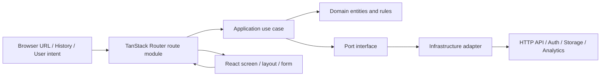
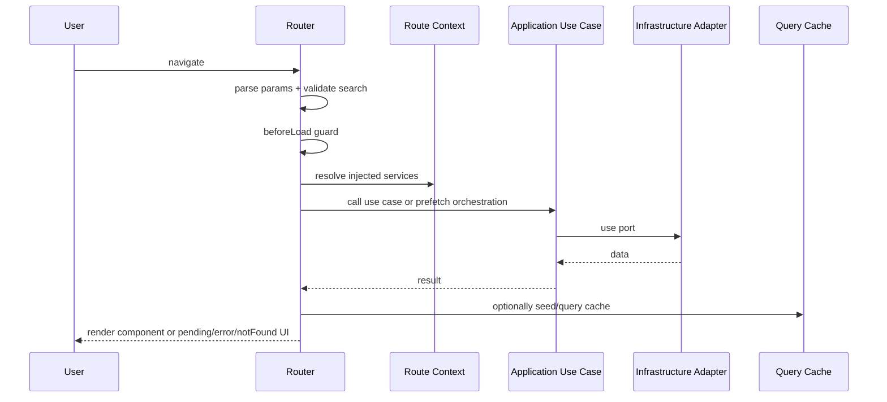

# Building Large React Applications with TanStack Router and Hexagonal Architecture

## Executive summary

For a large, high-complexity React application, the strongest architecture is to treat **TanStack Router as a delivery adapter and orchestration layer**, not as the place where core business rules live. TanStack Router is unusually capable for this role because it combines type-safe navigation, nested/layout routing, schema-validated params and search state, route loaders with stale-while-revalidate behavior, preloading, error/pending boundaries, and router-scoped dependency injection via router context. Those features make it a strong “application boundary” tool, but they do **not** eliminate the need to keep domain and use-case code independent from React, URL structure, and infrastructure details. citeturn6search12turn4view1turn7view0turn40view0

In practice, the best separation is this: **domain** owns invariants and business language; **application/use-case** code owns orchestration and ports; **infrastructure adapters** own HTTP, storage, auth SDKs, logging, and cache integration; **route modules** translate URL state into application inputs, invoke use cases, handle redirects/guards, and select pending/error UX. That mapping aligns directly with Cockburn’s original ports-and-adapters intent: the inside should not know about the outside, while adapters convert external stimuli into meaningful application calls. citeturn40view0turn7view0

For state and data, the best default for medium-to-large apps is: use **TanStack Query for server state**, keep **Redux Toolkit or Zustand only for client-only state that is genuinely cross-cutting**, keep **React Context for narrow, stable dependency and configuration injection**, and let **route loaders orchestrate prefetching and cache seeding** instead of doing ad hoc fetching inside page components. TanStack Query explicitly positions itself as a **server-state library**, not a replacement for local/client state management; Redux explicitly notes that not all apps need Redux and that it is most useful when state is widely shared, updated frequently, and complex over time. citeturn28view1turn29view1turn29view0turn34view0

For code organization, small apps can keep route files close to screens, but large apps should move toward **domain- or feature-centered modules** and, at monorepo scale, often a **separate router package** to preserve TanStack Router’s type augmentation and reduce circular dependencies. TanStack’s own monorepo example explicitly recommends a separate router library plus feature libraries and an integrating app package; community examples show complementary patterns using hexagonal and feature-sliced layouts. citeturn39view5turn39view0turn39view1turn39view2turn39view3

The most common failures in real projects are architectural, not syntactic: putting business rules in route files, using hooks directly inside loaders, reading search params in loaders without `loaderDeps`, treating route guards as security boundaries, overusing Context for volatile state, splitting loaders into separate chunks without a strong reason, and storing large amounts of server state in Redux or Zustand instead of Query. TanStack’s own docs warn against several of these directly. citeturn7view0turn18search0turn14view0turn20search7turn34view1turn28view1

## TanStack Router patterns for large, high-complexity applications

TanStack Router’s core value proposition is not just routing. Its official overview emphasizes fully inferred TypeScript support, type-safe navigation, nested/layout routes, built-in route loaders with SWR caching, automatic route prefetching, async route elements and error boundaries, JSON-first search params, parameter validation, inherited route context, and mixed file-based/code-based routing. For large applications, those capabilities matter because they let you move URL state, route data orchestration, and transition handling to a consistent boundary instead of re-solving them feature by feature. citeturn6search12turn4view10turn11view3

A high-scale app should use **route loaders as orchestration points**, not as business-logic containers. The data-loading guide states that routing is the best place to coordinate async dependencies because the router knows where the user is headed before content renders. It also documents the route loading lifecycle: route matching is top-down; `beforeLoad` runs serially before children; then route component preload and loaders run in parallel; and errors flow into route, parent-route, or router-level error components. citeturn4view1turn5view1

For route data, the most important implementation detail is that **URL-derived dependencies must be explicit**. TanStack Router intentionally does not pass raw search params directly to the loader, because loader keys and preloading/caching behavior should be tied to declared dependencies. The docs recommend validating search params and passing only the relevant values through `loaderDeps`; they also warn that using the whole search object can cause unnecessary cache invalidation. citeturn18search0turn5view0

```tsx
// src/routes/orders.tsx
import { createFileRoute } from '@tanstack/react-router'
import { z } from 'zod'

const ordersSearch = z.object({
  page: z.number().int().positive().catch(1),
  status: z.enum(['open', 'closed']).optional(),
})

export const Route = createFileRoute('/orders')({
  validateSearch: ordersSearch,
  loaderDeps: ({ search: { page, status } }) => ({ page, status }),
  loader: async ({ context, deps, abortController }) => {
    return context.orderQueries.list({
      page: deps.page,
      status: deps.status,
      signal: abortController.signal,
    })
  },
  staleTime: 10_000,
  pendingComponent: OrdersSkeleton,
  errorComponent: OrdersErrorBoundary,
  component: OrdersPage,
})
```

That pattern is preferable to fetching in `useEffect`, especially if you want preloading, cancellation, loader-level caching, route awareness, and predictable transition UX. TanStack Router exposes `abortController` to cancel outdated loader work, documents `staleTime`, `gcTime`, `shouldReload`, and `staleReloadMode`, and defaults stale successful loader reloads to background SWR behavior. citeturn5view5turn18search0turn14view0

Nested routing should do more than compose screens; it should define **architectural sub-boundaries**. TanStack’s routing concepts and outlets guides note that layout routes are appropriate for wrapping children with shared UI, loader requirements, validated search params, shared context, and shared pending/error fallbacks, while `<Outlet />` renders the next matching child route. This makes pathless or layout routes the right place for authenticated sections, tenant sections, dashboards, and other bounded route subtrees. citeturn4view10turn12view1

Path params and search params are both first-class, but they play different roles. Path params model hierarchical identity, are inherited by child routes, and are available in loaders, `beforeLoad`, and components via `useParams`. Search params are JSON-first, schema-validatable, inheritable from parent routes, and should be used for view state such as filtering, sorting, pagination, and return locations after auth. citeturn12view0turn6search1turn6search7

Authentication and route guarding belong in `beforeLoad`, generally on a pathless/layout parent for a protected subtree. TanStack’s auth guide documents `beforeLoad` as router middleware for the route and its children, recommends throwing `redirect()` there, and explicitly warns that a route guard does **not** protect a server function or other backend endpoint by itself. The guard is a UI/navigation control, not a security boundary. citeturn17view0turn20search7

```tsx
// src/routes/_authenticated.tsx
import { createFileRoute, Outlet, redirect } from '@tanstack/react-router'

export const Route = createFileRoute('/_authenticated')({
  beforeLoad: async ({ context, location }) => {
    const user = await context.auth.getCurrentUser()

    if (!user) {
      throw redirect({
        to: '/login',
        search: { redirect: location.href },
      })
    }

    return { user }
  },
  component: AuthenticatedLayout,
})

function AuthenticatedLayout() {
  return <Outlet />
}
```

For transitions, there are three distinct concerns. First, TanStack Router supports route-level pending UX with `pendingComponent`, shown after a configurable threshold; the data-loading guide says the default threshold is one second unless overridden per route or router. Second, TanStack Router supports preloading strategies such as intent, viewport, and render, which directly affect perceived transition speed. Third, the router supports optional browser View Transitions via `defaultViewTransition`, falling back when unsupported. citeturn5view7turn15view0turn15view2turn21search2turn21search1

For navigation state, large apps should distinguish **reactive UI state** from **imperative lifecycle observation**. TanStack’s router events guide recommends `router.subscribe` for analytics, external state cleanup, logging navigation timing, and DOM-dependent work after render; for reactive UI updates, it recommends framework hooks such as `useRouterState`, `useSearch`, and `useParams`. The `useRouterState` docs also note that `useLocation` and `useMatches` are usually more ergonomic and performant if that is all you need. citeturn11view2turn11view0

```tsx
import { useRouterState } from '@tanstack/react-router'

export function CurrentHref() {
  const href = useRouterState({
    select: (state) => state.location.href,
  })

  return <span>{href}</span>
}
```

Finally, error handling should be layered. TanStack Router supports route-level `onError` for logging and `errorComponent` for recovery UI, and it provides a default `ErrorComponent` as a safe fallback. For not-found handling, the newer `notFound()` / `notFoundComponent` APIs are the current direction; the older `NotFoundRoute` is deprecated. citeturn5view9turn5view8turn37search6

## Mapping TanStack Router into hexagonal architecture

Hexagonal architecture begins with an inside/outside rule. In Cockburn’s original article, the application should work without UI or database, adapters convert external events into application calls, and the code on the inside should not leak knowledge of external devices or technologies. That translates very naturally to frontend systems when you stop treating React and routing as “the app” and instead treat them as delivery mechanisms around the app core. citeturn40view0

The cleanest mapping is:

- **Domain layer**: entities, value objects, invariants, business rules, core policies.
- **Application layer**: use cases, command/query handlers, DTO translation, input/output ports.
- **Infrastructure adapters**: HTTP clients, auth SDKs, storage, analytics, feature flag providers, cache implementations.
- **Presentation adapters**: route modules, page components, forms, UI composition, browser/navigation concerns.

In this model, **TanStack Router is primarily an inbound adapter**. It translates browser location, history events, path/search params, and user navigation into application requests. It also coordinates cross-cutting delivery concerns such as preloading, pending fallbacks, not-found UX, redirect flows, and top-level route error boundaries. Those responsibilities are architectural, but they are still outside the domain. citeturn11view3turn4view1turn17view0turn40view0

The most useful TanStack-specific mechanism for hexagonal frontend design is **router context**. The docs explicitly describe router context as a dependency-injection tool, and show using it to pass services, Query clients, and even hook-derived values into routes and loaders. They also warn that you cannot use React hooks inside `beforeLoad` or `loader` because of the Rules of Hooks, so hook results should be created in React land and injected through router context. citeturn7view0

This suggests a strong convention:

- The **root route context** should carry stable adapter instances and application entry points: `queryClient`, `auth`, `logger`, `featureFlags`, `apiClients`, and sometimes typed use-case factories.
- Route files should call application-layer functions through those ports.
- Domain code should never import `@tanstack/react-router`, React hooks, or infrastructure packages.

```tsx
// application/ports/OrderRepository.ts
export interface OrderRepository {
  list(input: { page: number; status?: 'open' | 'closed' }): Promise<Order[]>
}

// application/use-cases/ListOrders.ts
export class ListOrders {
  constructor(private readonly repo: OrderRepository) {}
  execute(input: { page: number; status?: 'open' | 'closed' }) {
    return this.repo.list(input)
  }
}

// infrastructure/http/HttpOrderRepository.ts
export class HttpOrderRepository implements OrderRepository {
  async list(input: { page: number; status?: 'open' | 'closed' }) {
    const qs = new URLSearchParams({
      page: String(input.page),
      ...(input.status ? { status: input.status } : {}),
    })
    const res = await fetch(`/api/orders?${qs}`)
    if (!res.ok) throw new Error('Failed to fetch orders')
    return res.json() as Promise<Order[]>
  }
}

// routes/__root.tsx
import { createRootRouteWithContext } from '@tanstack/react-router'
import type { QueryClient } from '@tanstack/react-query'

export interface AppRouterContext {
  queryClient: QueryClient
  listOrders: ListOrders
  auth: {
    getCurrentUser(): Promise<{ id: string } | null>
  }
  logger: {
    error(error: unknown, meta?: Record<string, unknown>): void
  }
}

export const Route = createRootRouteWithContext<AppRouterContext>()({
  component: AppShell,
})
```

A route then becomes a translator, not a business object:

```tsx
// routes/orders.tsx
import { createFileRoute } from '@tanstack/react-router'
import { z } from 'zod'

export const Route = createFileRoute('/orders')({
  validateSearch: z.object({
    page: z.number().int().positive().catch(1),
  }),
  loaderDeps: ({ search: { page } }) => ({ page }),
  loader: ({ context, deps }) => context.listOrders.execute({ page: deps.page }),
  onError: ({ error, context }) => context.logger.error(error, { route: '/orders' }),
  component: OrdersPage,
})
```

That separation has two large payoffs. First, it preserves **testability**: Cockburn’s article explicitly argues that the application should be runnable in automated tests without GUI or database dependencies. Second, it preserves **replaceability**: TanStack Router can change, hosting can change, HTTP clients can change, but your domain and application layers remain stable. citeturn40view0

This is the architectural shape that scales best:



And this is the route-execution flow worth aiming for in complex apps:



The practical rule is simple: **URLs, route IDs, redirect mechanics, preloading policy, and route transition UX are adapter concerns; order validation limits, authorization rules, pricing rules, and workflow invariants are domain/application concerns.** Write translators between them. Do not collapse them into one file just because the framework lets you. citeturn40view0turn7view0

## Folder and module layouts for large apps

There is no single “best” layout, but there are clear scaling breakpoints. TanStack Router supports both file-based and code-based routing, and even mixed usage, so the real decision is not only how you define routes but how you keep the routing surface from swallowing the rest of the codebase. citeturn11view3turn6search12

For a **small-to-medium app**, the best layout is usually **route files plus feature modules**. Keep route files in `src/routes`, but move business-heavy logic into `src/features/<feature>` with an internal hexagonal split. Route files should mainly define the URL boundary, loader/guard behavior, and top-level screen component.

```text
src/
  routes/
    __root.tsx
    _authenticated.tsx
    orders.tsx
    orders.$orderId.tsx
  features/
    orders/
      domain/
        Order.ts
        OrderPolicy.ts
      application/
        ports/
          OrderRepository.ts
        use-cases/
          listOrders.ts
          getOrder.ts
      infrastructure/
        http/
          HttpOrderRepository.ts
        query/
          orderQueries.ts
      presentation/
        screens/
          OrdersPage.tsx
          OrderDetailPage.tsx
        components/
          OrdersTable.tsx
          OrderFilters.tsx
```

For a **large modular monolith**, I recommend a stricter import rule: only `routes/` and `presentation/` may import router APIs; only `infrastructure/` may import transport/storage SDKs; `domain/` imports neither React nor router nor infra. That rule is more important than the folder names themselves, and it directly follows the inside/outside asymmetry in hexagonal architecture. citeturn40view0

For a **monorepo or very large multi-team app**, TanStack’s own example is especially instructive. The official `router-monorepo-simple-lazy` example describes a challenge specific to TanStack Router: in monorepos, TypeScript type augmentations create friction if links live in feature libraries. Their documented solution is a separate `packages/router` library for router definitions and type augmentations, separate feature libraries, and an app package that maps routes to components. They call out two concrete benefits: preserving type-safe routing across libraries and using loaders in the router and feature library without circular dependencies. citeturn39view5

```text
packages/
  router/
    src/
      routes/
      routeTree/
      index.ts
  features/
    orders/
      src/
        domain/
        application/
        infrastructure/
        presentation/
    billing/
      src/
        domain/
        application/
        infrastructure/
        presentation/
  app/
    src/
      main.tsx
      providers/
      route-component-map.ts
```

That pattern is particularly strong when different teams own independent bounded contexts and the router package acts as the shared “delivery contract.” It also fits hexagonal principles well: the router package owns route boundary definitions, while feature packages own business behavior. citeturn39view5

Community examples reinforce the same direction from other angles. CodelyTV’s frontend hexagonal example explicitly separates domain, application, and infrastructure layers in a TypeScript frontend. Maua-Dev’s template describes a React + TypeScript hexagonal layout whose goal is to decouple business logic from UI frameworks, databases, and APIs. On the feature-sliced side, `dmaximyuk/reactjs-template` and `tsu-moe/tsu-stack` show that TanStack Router works well inside feature-sliced and monorepo structures, often alongside React Query and Zustand. These are examples, not standards, but they are useful evidence that large React apps do converge on modular, domain-centered layouts rather than “everything under routes.” citeturn39view0turn39view1turn39view2turn39view3

My recommended naming conventions for a large codebase are:

- Keep route definitions thin: `route.tsx`, `route.lazy.tsx`, or file-based route files should express URL, validation, guards, loader orchestration, and boundary components.
- Put schemas near the route boundary: `route.schema.ts` or `search.schema.ts`.
- Put Query config near the feature/infrastructure boundary: `query-options.ts` or `<feature>.queries.ts`.
- Prefer `screen` over `page` if you want to reserve “page” for route files; otherwise be consistent.
- Keep “ports” and “adapters” explicit in the application and infrastructure layers; do not hide them behind generic `services/` folders in large apps.
- Use `getRouteApi()` from deep child components instead of importing route definitions directly when that avoids circular dependencies and improves code-split ergonomics. TanStack explicitly recommends `getRouteApi` for that use case. citeturn18search0turn16view1

## State management, data fetching, caching, code splitting, and performance

The most important state-management decision is to **separate server state from client-only state**. TanStack Query’s docs state plainly that Query is a server-state library, while Redux, MobX, and Zustand are client-state libraries. Query also notes that after migrating server state out of a global client store, the remaining globally accessible client state is often quite small. That is the right mental model for most large line-of-business and content-heavy apps. citeturn28view1

That leads to a clear division of labor.

**React Context** is best for stable, low-frequency, broadly required dependencies: current user, theme, feature-flag client, localization config, API factories, and router-injected adapter instances. React’s docs emphasize that components reading a context re-render when the provider value changes, and they specifically recommend memoizing object/function values with `useMemo` and `useCallback` to avoid unnecessary re-renders. TanStack Router’s router context then extends this nicely into loaders and guards. citeturn34view0turn34view1turn7view0

**Redux Toolkit** is best when you truly need a centralized client-state model with high traceability, time-travel, predictable updates, and complex cross-cutting synchronous state transitions. Redux’s own docs say RTK is the official recommended way to write Redux logic, and that Redux is most useful when large amounts of state are needed in many places, updated frequently, and complex over time in medium-to-large codebases. They also explicitly note that using local component state is fine and that not all state belongs in Redux. citeturn29view0turn29view1turn29view2turn29view3

**Zustand** is a good fit for lighter-weight client-only orchestration state when you want less ceremony than Redux. The official repository describes it as small, fast, and scalable, with a hook-based API. In a hexagonal architecture, though, Zustand should still live outside the domain boundary; use it for UI/workflow state, not as a substitute domain model and not as your main server-state cache. citeturn33search0turn28view1

**TanStack Query** should be the default for server state in large apps. Its important defaults are worth understanding: queries are stale by default, stale queries refetch on mount/focus/reconnect unless configured otherwise, inactive queries remain cached and are garbage-collected after five minutes by default, failed queries retry three times with exponential backoff, and query results are structurally shared by default. Query keys must be arrays, must be JSON-serializable, and should include every variable the query function depends on. The `queryOptions` helper is the best official way to keep query key/query function definitions co-located and type-safe across `useQuery`, `useSuspenseQuery`, `prefetchQuery`, and direct cache calls. citeturn26view0turn26view2turn26view3turn26view4turn26view7turn26view6turn26view8turn26view9

For a large TanStack Router app, the best default data pattern is:

1. Use the **route loader** to validate URL state and orchestrate critical data loading.
2. Seed or ensure the **Query cache** from the loader.
3. Read data in components with **`useSuspenseQuery`** for critical paths.
4. Initiate non-critical or below-the-fold data in parallel via `prefetchQuery`/`fetchQuery` or deferred loading patterns.

TanStack Router’s Query integration docs explicitly recommend preloading critical data in a route loader with `ensureQueryData`, then reading it with `useSuspenseQuery` to avoid waterfalls and flashes. They also explain that if you want Query to manage freshness, you should align router preloading behavior accordingly. Separately, TanStack Router’s preloading docs say that when using an external cache like Query, setting `defaultPreloadStaleTime: 0` causes preload events to invoke loaders consistently and lets the external cache’s `staleTime` govern freshness. citeturn35view0turn15view4

```tsx
// features/orders/infrastructure/query/orderQueries.ts
import { queryOptions } from '@tanstack/react-query'

export const orderQueries = {
  list: (input: { page: number }) =>
    queryOptions({
      queryKey: ['orders', input],
      queryFn: () =>
        fetch(`/api/orders?page=${input.page}`).then((r) => r.json()),
      staleTime: 30_000,
    }),
}

// routes/orders.tsx
import { createFileRoute } from '@tanstack/react-router'
import { useSuspenseQuery } from '@tanstack/react-query'
import { orderQueries } from '@/features/orders/infrastructure/query/orderQueries'

export const Route = createFileRoute('/orders')({
  validateSearch: (search) => ({ page: Number(search.page ?? 1) }),
  loaderDeps: ({ search }) => ({ page: search.page }),
  loader: ({ context, deps }) =>
    context.queryClient.ensureQueryData(orderQueries.list({ page: deps.page })),
  component: OrdersPage,
})

function OrdersPage() {
  const { page } = Route.useSearch()
  const { data } = useSuspenseQuery(orderQueries.list({ page }))
  return <OrdersTable rows={data} />
}
```

When should you use **TanStack Router’s built-in loader cache without Query**? The Router docs are clear: the router cache is often a good fit for smaller to medium apps, especially when data is relatively route-local and shared little between routes. But TanStack also lists its limitations directly: no shared caching/deduping between routes, no persistence model, no built-in mutation APIs, and only coarse invalidation. For a large enterprise app with heavy cross-route server-state reuse, Query is usually the better fit. citeturn18search0

Preloading is a major performance lever. TanStack Router supports preloading by intent, viewport visibility, and render. Unused preloaded route matches are kept temporarily in memory and removed after 30 seconds by default; `defaultPreload`, `defaultPreloadDelay`, `defaultPreloadMaxAge`, and `defaultPreloadStaleTime` let you tune behavior. For large apps, `defaultPreload: 'intent'` is usually the strongest default because it improves perceived performance without being as aggressive as render-based preloading. citeturn15view0turn15view2turn15view3turn15view4

Code splitting should be **route-first, component-second**. TanStack Router’s automatic code splitting is the preferred route-level option when using file-based routing with a supported bundler. It rewrites route definitions to lazy-load pieces of the route, can split `component`, `errorComponent`, `pendingComponent`, `notFoundComponent`, and optionally the loader, and supports global or per-route split grouping control. But the docs are explicit that splitting loaders is a trade-off they **highly discourage** in most cases because it adds an extra trip before data can be fetched. They also warn that exporting route properties prevents them from being split. If the automatic plugin cannot be used, `.lazy.tsx` plus `createLazyFileRoute` is the manual fallback. citeturn14view0turn37search3turn4view4

React’s own `lazy` remains useful for **intra-route** code splitting, such as heavy editors, charts, or admin-only widgets. React documents that `lazy` caches the import promise and resolved module, and that rejected loads bubble to the nearest Error Boundary; `Suspense` should wrap those chunks. React also cautions that Suspense does not detect data fetched inside effects or event handlers, which is another reason to keep route and query data orchestration out of `useEffect`. citeturn30view1turn30view2

On raw rendering performance, TanStack Router recommends fine-grained selectors and optional structural sharing for router-derived state. `useRouterState`, `useSearch`, and similar hooks support selection; the render-optimizations guide shows that structural sharing can preserve references across updates, especially for URL-backed state. Combined with React Context memoization and stable query keys, this substantially reduces unnecessary re-renders in deep route trees. citeturn11view1turn20search6turn34view1

The highest-value approach comparison is below.

| Approach | Best at | Main trade-offs | Recommended default |
|---|---|---|---|
| Router loaders + router cache | Simple route-local data, minimal dependencies, smaller/medium apps | Coarse invalidation, limited cross-route sharing, no built-in mutation model | Use when route data is mostly isolated and the app is not server-state heavy |
| Router loaders + TanStack Query | Shared server state, mutations, prefetching, cache reuse, large apps | More moving parts, requires query-key discipline | **Best default for large apps** |
| React Context | Low-frequency global dependencies and configuration | Provider value changes re-render consumers; poor fit for chattery state | Use for DI/config/auth/session shape, not as a high-churn store |
| Redux Toolkit | Complex synchronous global state, auditability, time-travel, many contributors | More concepts and boilerplate than lighter tools | Use only when its strengths are real requirements |
| Zustand | Lightweight client-only workflow/UI state | Easier to overuse as an unstructured global bag | Use for local-to-global UI state, not for primary server state |
| Auto route code-splitting | Large route trees with file-based routing and supported bundlers | Requires plugin conventions; route property export mistakes can break splitting | Prefer over manual lazy route management |
| Manual `.lazy.tsx` route splitting | Bundlers/setups where auto splitting is unavailable | More manual discipline, easier to drift | Use as fallback, not first choice |

This matrix is synthesized from TanStack Router’s own data-loading, automatic code-splitting, and Router/Query integration docs; React’s context guidance; Redux’s usage guidance; and TanStack Query’s server-state positioning. citeturn18search0turn14view0turn35view0turn34view1turn29view1turn29view0turn28view1

## Testing, observability, CI/CD, and deployment

Hexagonal architecture pays for itself most visibly in testing. Cockburn’s original argument is that the application should work without UI or database so it can be regression-tested in isolation. Frontend teams often miss that lesson because everything feels “UI-first,” but it applies just as strongly in React. The more business logic you keep out of routes and components, the larger your unit-test surface becomes and the less brittle your tests are. citeturn40view0

The recommended testing stack for this architecture is layered:

- **Unit tests** for domain and use-case code with mocked ports.
- **Route/module integration tests** for search validation, loader orchestration, guards, pending/error UI, and cache interactions.
- **Component tests** for interactive widgets and route screens.
- **E2E tests** for navigation, deep linking, refresh behavior, auth redirects, lazy routes, and unsaved-change blockers.

React Testing Library’s own introduction says its philosophy is that tests should resemble the way software is used, and its query docs explain the difference between `get*`, `find*`, and `query*` methods. For integration-heavy routed apps, that philosophy is especially valuable: test accessible UI outcomes, not internals of the router. citeturn36search5turn36search2turn36search17

For Query-specific testing, the official testing guide emphasizes that React Query’s main purpose is caching network requests, so tests should verify network behavior first. That means route-loader tests should usually mock adapter/network boundaries and assert cache/query outcomes, not mock every hook in sight. citeturn36search0

For browser-level E2E, Playwright is a strong fit because its docs emphasize automatic waiting, resilient assertions, and built-in cross-browser execution. In a TanStack Router app, your E2E suite should always include direct-entry deep links, refresh-on-nested-route behavior, search-param preservation, login redirect-and-return flows, navigation-blocking flows, and lazy-route/error-boundary recovery cases. citeturn36search1turn36search7turn36search13turn36search19

Vitest complements this well in Vite-based stacks. Vitest’s docs note that it reads `vite.config.*` by default, which reduces friction in projects already using the TanStack Router Vite plugin, and its mocking utilities are well suited for adapter-boundary tests. citeturn36search18turn36search3

Observability should be split the same way as the architecture. Use route `onError` and `errorComponent` for user-facing and route-level failure handling, but use infrastructure adapters for actual log shipping, tracing, and monitoring. TanStack Router’s router-events API is ideal for navigation analytics and timing because it emits `onBeforeNavigate`, `onBeforeLoad`, `onLoad`, `onBeforeRouteMount`, `onResolved`, and `onRendered`, and explicitly recommends `router.subscribe` for analytics and logging navigation timing. citeturn5view9turn5view8turn11view2

A robust pattern looks like this:

```tsx
// router bootstrap
router.subscribe('onResolved', ({ toLocation, fromLocation }) => {
  analytics.pageView({
    to: toLocation.href,
    from: fromLocation?.href,
  })
})

// in a route
export const Route = createFileRoute('/orders/$orderId')({
  onError: ({ error, context, params }) => {
    context.logger.error(error, {
      route: '/orders/$orderId',
      orderId: params.orderId,
    })
  },
  errorComponent: ({ error }) => <OrderScreenError error={error} />,
  component: OrderDetailScreen,
})
```

In CI/CD, the most important rule is to test **the route boundary as a boundary**. That means your pipeline should fail fast on route generation/build, TypeScript checks, linting, unit tests, integration tests, and E2E smoke tests against preview deployments. Because TanStack Router’s type safety relies on router registration and, in file-based mode, generated route trees, broken route typing should be treated as a build failure, not a runtime discovery. TanStack’s own router creation and migration docs are explicit about router registration via declaration merging and bundler-plugin setup. citeturn11view3turn38view0

Deployment needs one TanStack-specific check that teams frequently miss: **SPA deep-link handling**. TanStack’s production deployment guide says SPA hosts must serve `index.html` for all routes so the client-side router can resolve navigation. If your hosting platform cannot do rewrites, TanStack’s history-types guide recommends hash routing as a fallback. citeturn37search1turn37search2

If you later add SSR, TanStack’s Query integration docs say you should create a **fresh `QueryClient` per request** and wire the integration so dehydration/hydration and streaming work correctly. Even if you are not using SSR today, this is a useful discipline to keep in mind when designing your app shell and DI boundaries. citeturn35view2

## Migration strategies and common anti-patterns

The safest migration path from another router is **incremental boundary replacement**, not a big-bang rewrite. TanStack’s React Router migration guide explicitly suggests preparing a migration branch, installing TanStack Router alongside React Router temporarily, wiring the router plugin, creating a route configuration, then converting route definitions, navigation components, and search-param handling step by step. It also highlights the changes needed for links, `useNavigate`, deferred data patterns, and search handling. citeturn38view0

A pragmatic migration plan for a large existing app is:

1. Introduce router bootstrap and type registration.
2. Convert the root shell and one self-contained subtree.
3. Replace one feature’s URL/search handling with `validateSearch` and typed params.
4. Move data orchestration from components/effects into loaders.
5. Introduce application ports and router context for DI.
6. Migrate auth guards to layout/pathless routes.
7. Add Query cache seeding in loaders for shared server data.
8. Remove old router usage once all links and entry paths are migrated.

That sequence minimizes risk because each step improves architectural separation, not just API parity. citeturn38view0turn38view1

The anti-patterns to avoid are consistent across both TanStack Router and hexagonal architecture.

The first is **letting domain logic leak into routes or components**. Cockburn called out business logic infiltration into UI code as the core problem that ports-and-adapters is meant to solve. Route files should translate and orchestrate; they should not become domain policy files with JSX attached. citeturn40view0

The second is **using hooks directly in `loader` or `beforeLoad`**. TanStack Router explicitly says you cannot do that because of the Rules of Hooks, and recommends injecting hook-derived values through router context instead. If you ignore this, you usually end up with both architectural leakage and invalid React usage. citeturn7view0

The third is **using search params in loaders without `validateSearch` plus `loaderDeps`**. TanStack explicitly designed loaders to discourage that, because undeclared loader dependencies break caching and preloading correctness. In large apps, this becomes a subtle source of wrong-data and stale-data bugs. citeturn18search0turn5view0

The fourth is **treating route guards as real security**. TanStack’s auth guide is blunt: route guards gate UI, not backend reachability. Sensitive operations still need handler-level or API-level auth enforcement. citeturn20search7

The fifth is **overusing Context as a general store**. React re-renders all consumers when a provider value changes, and new object/function identities in context values can trigger deep re-render cascades. Use Context for stable dependencies and coarse session/config state, not for chatty collections or frequently mutating UI state. citeturn34view0turn34view1

The sixth is **using Redux or Zustand to cache most server data**. TanStack Query explicitly argues that Query is the server-state tool, and that client-state libraries are inefficient for that job compared with a dedicated server-state library. Redux’s own docs also say not all state belongs in Redux. A large routed app is easier to reason about when server state is keyed, invalidated, and prefetched by Query, while client-only state lives elsewhere. citeturn28view1turn29view2

The seventh is **splitting loaders aggressively**. TanStack Router’s automatic code-splitting guide specifically discourages moving loaders into their own chunks unless there is a strong reason, because that adds another request before data fetching can even begin. Split route UI first; split data orchestration only deliberately. citeturn14view0

The eighth is **exporting route properties when relying on automatic code splitting**. The docs explicitly warn that exporting `component`, `loader`, and similar route properties causes them to stay in the main bundle and defeats the split. citeturn14view0

The ninth is **using the raw router instance as reactive state**. TanStack’s docs note that `router.state` is current but not reactive; for reactive rendering, use `useRouterState`, `useLocation`, `useMatches`, `useSearch`, and `useParams` instead. citeturn11view0turn9search15

The tenth is **letting route definitions and feature packages form circular imports**. TanStack’s own monorepo example exists largely to avoid this problem while preserving type-safe links across packages. In large codebases, a small amount of packaging discipline prevents enormous maintenance pain later. citeturn39view5

## Open questions and limitations

This report is optimized for **React + TanStack Router** without assuming a full-stack framework or a specific hosting platform, so SSR, server functions, RSC, and framework-owned deployment flows are covered only where they materially affect architectural choices. TanStack Router does support SSR and TanStack Start builds on it, but the operational details of streaming SSR, server functions, and document-wide rendering were not expanded here because your stated constraint was framework-agnostic React rather than adoption of TanStack Start specifically. citeturn39view4turn35view2

A second limitation is that official documentation is strong on router, Query, and framework APIs, but naturally thinner on “one true” frontend hexagonal folder layout. The hexagonal layout recommendations here are therefore a synthesis of Cockburn’s original architectural principle, TanStack’s official router-context and monorepo patterns, and several GitHub examples from the community, rather than a single canonical vendor-prescribed structure. citeturn40view0turn7view0turn39view5turn39view0turn39view1turn39view2turn39view3